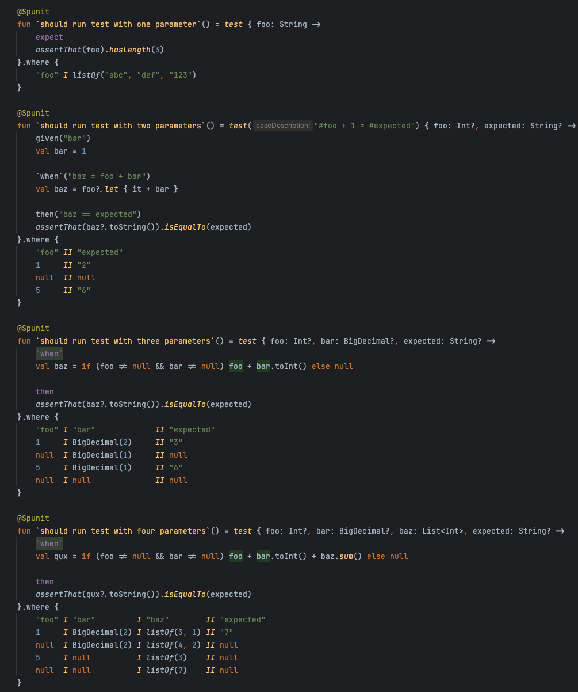
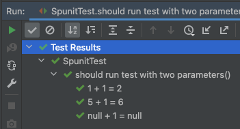

Spunit
==============================
# What is this?

This library has one purpose: to mimic Spock elegance in Kotlin JUnit 5 tests.

# Ok sounds good, so show me the code.

Look at this screenshot and decide if you want stick to parameterized tests in JUnit 5, or write tests with Spock elegance in Kotlin.



# Disclaimer
This library is in early development stage, API can be changed from version to version, documentation is not finished, bugs and not well described exception can happen.

# Documentation

## Features inspired by Spock
- [x] Parametrization with `where` table. Types of parameters are strictly checked.
```kotlin
@Spunit
fun test() = test { foo: Int?, bar: BigDecimal, expected: String? ->
        // test code
    }.where {
        "foo" I "bar"             II "expected"
        1     I BigDecimal(2)     II "3"
        null  I BigDecimal(1)     II null
        5     I BigDecimal(1)     II "6"
    }
```
- [x] `given`, `when`, `then`, `expect` blocks.
```kotlin
        given("bar")
        val bar = 1

        `when`("baz = foo + bar")
        val baz = foo?.let { it + bar }

        then("baz == expected")
        assertThat(baz?.toString()).isEqualTo(expected)
```
- [x] Parametrization of test title.
```kotlin
@Spunit
fun `should run test with two parameters`() = test("#foo + 1 = #expected") { foo: Int?, expected: String? ->
        // code
    }.where {
        "foo" II "expected"
        1     II "2"
        null  II null
        5     II "6"
    }
```


## How to start
Add one dependency, and you are good to go.
```groovy
testImplementation group: 'pl.allegro.tech', name: 'spunit', version: version
```
A good introduction to this library is this [test file](./src/test/kotlin/pl/allegro/tech/spunit/SpunitTest.kt).

## Gotchas
- This lib is build on Junit 5 dynamic tests. Lifecycle of dynamic test is different from normal. `@BeforeEach`, `@AfterEach` are only run once on start and end respectively. This problem is solved by Spunit lifecycle hooks (`SpunitHooks` interface).
- Sometimes title of parameterized test doesn't render parameters at all. There is an issue in gradle repo which tracks this problem https://github.com/gradle/gradle/issues/5975. 
- There is no formatter for where block, so autoformatting can make mess.

# Changelog
## 0.1.1
- Fix OneParamTestCase displayName
## 0.1.0
- Release as open-source software

# License
Spunit is released under the Apache 2.0 license (see [LICENSE](LICENSE))
